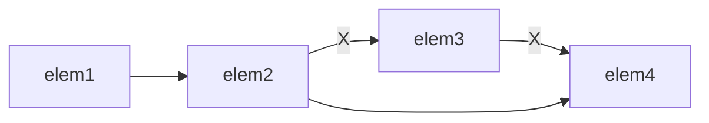

#### Chapter 9 Sequential Containers

- a common interface
- performance vs. functionality trade-off
- storing strategies have an inherent impact on the efficiency of operations

*Technically speaking, a `string` is not a container. But it supports many of the containers' operations.*

> What's the difference between a sequential container and an associative container?

|      | sequential                                                   | associative                                         |
| ---- | ------------------------------------------------------------ | --------------------------------------------------- |
|      | store and access the elements based on the positions at which they are put into the container | store and access the elements based on their values |

##### 9.1 Overview of the Sequential Containers

> What's the fundamental trade-off among the different types of sequential containers?

Fast insertion/erasure vs. fast random access

| fast                        | `vector` | `deque` | `list` | `forward_list` | `array` | `string` |
| --------------------------- | :------: | :-----: | :----: | :------------: | :-----: | :------: |
| insertion/erasure anywhere |    x     |    x    |   o    |       o        |    x    |    x     |
| random access               |    o     |    o    |   x    |       x        |    o    |    o     |

> Which containers store elements in contiguous memory? What about `deque`?

`vector` and `string`. No.

> Which container tends to have a heavier memory overhead, `deque` or `forward_list`?

`forward_list`

> What's special about `array`, compared with other sequential containers?

It has fixed size.

> What's special about `forward_list`, compared with other sequential containers?

1. It does not have `size` operation [^linked list].
2. It has special interface of insertion and erasure.

[^linked list]: in order to compete with the best handwritten singly linked list

> Is `size` guaranteed to be an O(1) operation?

Yes, since C++11.

> A program needs to insert elements in the middle of the container only when reading input, and subsequently needs random access. Which container(s) should it use?

1. use a `vector` to `push_back`, then `sort`, or
2. use a `list` to read, then copy the `list` into a `vector`

> What could you do if you're not sure of which container to use at the beginning of writing your program?

1. write your code using operations that are common to both `vector` and `list`
2. use iterators, not subscripts
3. avoid, if possible, random access to elements


##### 9.2 Container Library Overview

> Class `T` does not have a default constructor. Is it possible to define a `vector<T>`?

Yes. It is possible to define a container whose element type does not meet certain operation-specific requirements, so long as we do not use that operation. For example, in this case, we may define like `vector<T> vec(10, initializer);` given that `T t(initializer);` is permitted, but we cannot define like `vector<T> vec(10);`.

> There are three companion types defined for each container. All of them have the form `xxx_type`. What are they?

1. `size_type` for the size of the container
2. `difference_type` for the distance between iterators
3. `value_type` for the element type

> There are four ways to construct a container in general. Three of them are:
>
> 1. default construct: `C c;`
> 2. copy construct: `C c1(c2);`
> 3. list initialize: `C c{a, b, c, ...};`
>
> What is the fourth way?
>
> *Hint: The fourth way is not valid for `array`.*

Copy constructor from an iterator range: `C c(b, e);`

> Given `vec` is a `vector<T>`. What type does `vec.crbegin()` return?

`vector<T>::const_reverse_iterator`

> Do all the iterators support `--it` operation?

No, not for `forward_list`.

> Does `array` support `it1 - it2` operation for its iterators?

Yes.

>  Does `list` support `it += n` operation for its iterators?

No.

> Does `list` support `<=` operation for its iterators?

No.

> How many elements are there in an iterator range `[b, e)`?

Exactly `e - b`.

> What does `if (b != e) //...` do for an iterator range `[b, e)`?

If the container is not empty, then do.

> Let `[b, e)` be an iterator range.
>
> 1. How to use an iterator range to represent the first half, excluding the one right in the middle?
> 2. What if we include the one right in the middle?

1. `[b, m)` where `m = b + (e-b)/2;`. 
2. make an adjustment with `m = (e-b) % 2;`

> Given an iterator range `[b, e)`, what does the following iterative statement do?
>
> ```c++
> while (b != e)
>     *b++ = val;
> ```

Assign `val` to each element in the iterator range.

> What do you think is the advantage of using `[b, e)` rather than `[b, e]` to represent a range?

1. Fewer points needed to represent several adjacent intervals. Consider dividing a range into two halves. Using left-closed-right-open intervals, we only need three points: `[b, m)` and `[m, e)`. With closed intervals, we need four points: `[b, m]` and `[m+1, e]`.
2. It is often useful to allow a special return. With `[b, e)` representation, we could do this by returning an iterator to `e`. For example, consider finding a value in a range `[b, e)` and returning the position where the value first appears. If nothing is found, we could return an iterator to `e`.

> Does a `list` have a `reverse_iterator`?

Yes. A `list` supports bidirectional sequential access.

> What does `vector<string>::const_reference` stand for?

`const string &`

> What type should be used as the index into a `vector` of `int`s?

`vector<int>::size_type`

> Consider
>
> ```c++
> vector<int> u;
> const auto i = u.begin();
> auto j = u.cbegin();
> const vector<int> v;
> auto k = v.begin();
> ```
>
> Do `i` and `j` have the same type? What about `j` and `k`?

No. Yes.

 `i` is  a `const vector<int>::iterator`.

`j` is a `vector<int>::const_iterator`.

`k` is a `vector<int>::const_iterator`.

> Suppose `c` is a container, and `D` is a container type. To initialize a container `d`, what's the advantage that `D d(c.begin(), c.end());` enjoys over `D d(c);`?

To initialize a container from an iterator range, the container and element types can be different, so long as conversion is possible. That is, `c` may have a type `C` that is different from `D`. Besides, using an iterator range, we may just copy a subsequence of the original container.

> Define an `array` of 42 `int`s. In addition, define an index for it.

```c++
array<int, 42> a;
array<int, 42>::size_type i;
```

> Except for what, a default constructed container is empty?

`array`, which has as many elements as its size. These elements are default initialized.

> What's the difference between built-in array types and the library `array` types?

The library `array` types supports copy and assignment, which the built-in array types does not support.

For example,

```c++
array<int, 5> a = {1, 2 ,3};    // a has 1, 2, 3, 0, 0
array<int, 5> b = {4, 5 ,6};    // b has 4, 5, 6, 0, 0
array<int, 5> c(a);             // equivalently, array<int, 5> c = a; not for built-in arrays
c = b;                          // not for built-in arrays
c = {7, 8, 9};			       // c has 7, 8, 9, 0, 0; not for built-in arrays
```

The only valid forms of initialization for a built-in array are:

1. default initialization
2. curly braced list initialization


> We have already defined `=` operator for containers. Why do we need an extra `assign` member function?

`assign` is overloaded, which makes it more flexible.

1. `assign` allows us to assign from a different but compatible type.
2. `assign` allows us to assign a subsequence of a container.
3. `assign` allows us to assign with `n` elements of value `t`.
4. `assign` allows us to assign with an initializer list.

For example,

```c++
// case 1
vector<int> u = {1, 2, 3, 4, 5};
vector<int> v;
v.assign(u.cend() - 3, u.cend());
// case 2
vector<const char *> w = {"And", "But"};
list<string> x;
x.assign(w.cbegin(), w.cend());
// case 3
vector<char> y;
y.assign(100, '-');
// case 4
vector<int> z;
z.assign({-1, 0, 1});
```

> Is the following assignment legal?
>
> ```c++
> list<string> names;
> vector<const char *> oldstyle;
> names.assign(oldstyle);
> ```

No. Must use an iterator range like

```c++
names.assign(oldstyle.cbegin(), oldstyle.cend());
```

> Where is `std::swap` defined?

`<utility>`

> What is special about `swap` for an `array`?

Time complexity is O(n), not O(1) as in the general case.

> What is special about `swap` for a `string`?

Any iterators, pointers and references related to the objects are invalidated.

> What is the output of
>
> ```c++
> vector<int> v1 = {1, 2, 3};
> vector<int> v2 = {4, 5, 6, 7, 8, 9};
> auto it = v1.begin();
> swap(v1, v2);
> cout << *it << endl;
> ```

1

> Only what kind of containers do not support `<=` operator?

Unordered associative containers.

> What is the output of
>
> ```c++
> vector<int> a = {1, 2, 3};
> vector<int> b = {1, 3};
> cout << (a <= b) << endl;
> ```

1

##### 9.3 Sequential Container Operations

> Given `s` is a `string`, is `s.push_back('c');` legal?
>
> What about `s.push_back("c");`?
>
> What about `char c = 'c'; s.emplace_back(c);`?

Yes. No. No.

*A `string` does not have `emplace` member functions.*

> What is the output of
>
> ```c++
> string s = "Hello, World!";
> auto it = s.begin();
> s.insert(it, ':');
> cout << s << endl;
> ```

`:Hello, World!`

> Is it legal to insert anywhere in a `vector`?

Yes, though it may be expensive to do so.

> Given
>
> ```c++
> vector<string> v1 = {"good", "morning", "evening", "night"};
> vector<string> v2 = {"may", "I", "help", "you"};
> ```
>
> Insert the first two elements of `v1` to `v2`.

```c++
v2.insert(v2.begin(), v1.begin(), v1.begin() + 2);
```

> Consider an insertion with
>
> ```c++
> v2.insert(v2.begin(), v1.begin(), v1.begin() + 2);
> ```
>
> Can we instead write
>
> ```c++
> v2.insert(v2.cbegin(), v1.cbegin(), v1.cbegin() + 2);
> ```

Yes.

> Given `c` is a container, `it` an iterator, and `[b,e)` an iterator range, what does the following line do?
>
> ```c++
> if (c.insert(it, b, e) != it) //...
> ```

Insert the elements in `[b,e)` before `it`. If anything is inserted, then do.

> Consider
>
> ```c++
> list<string> lst;
> for (string word; cin >> word; lst.push_front(word))
>     ;
> ```
>
> Rewrite the code using `insert`.

```c++
list<string> lst;
auto it = lst.begin();
for (string word; cin >> word; it = lst.insert(it, word))
    ;
```

> Does a library `array` have a `front` member function?

Yes.

> Does every library container have a `back` member function?

No. `forward_list` does not have a `back` member function.

> Does a `forward_list` support `push_back` operation?

No.

> What's the problem with the following function?
>
> ```c++
> int get_first(const vector<int> & v) { return v.front(); }
> ```

If `v` were empty, `v.front()` would be undefined. To fix it,

```c++
int get_first(const vector<int> & v) { return v.at(0); }
```

> Given `a` is a library `array` type, is it always safe to access `a[0]`?

No. Unlike built-in array types, the library `array` type allows an object of size zero, in which case `a[0]` would have undefined behavior. To make it safe, use `a.at(0);`.

> Which iterators, pointers and references are invalidated after `insert`, `erase`, and `swap`?

| container      | `insert`                                       | `erase`                                                      | `swap`       |
| -------------- | ---------------------------------------------- | ------------------------------------------------------------ | ------------ |
| `vector`       | all                                            | after point of erasure                                       | none         |
| `deque`        | front/back: all iterators only; elsewhere: all | front: none; back: off-the-end iterator only; elsewhere: all | none         |
| `list`         | none                                           | none                                                         | none         |
| `forward_list` | none                                           | none                                                         | none         |
| `array`        | not applicable                                 | not applicable                                               | none [^time] |
| `string`       | all                                            | after point of erasure                                       | all          |

[^time]: a time-consuming operation though

> Explain why `forward_list` has specialized inserting/erasing operations.

Consider a singly linked list



If we erase `elem3`, both `elem2` and `elem4` have to be changed. Had we focused on `elem3`, we would have no easy way to go back to `elem2`, because the link is one-way. A better design is to focus on `elem2` if we plan to erase `elem3`. This explains the intuition for the specialized `erase_after`, and `insert_after`, `emplace_after` as well.

> Let `flst` be a `forward_list<int>`. Insert 0 at its beginning.

```c++
flst.insert_after(flst.before_begin(), 0);
```

> What is the output of
>
> ```c++
> #include <forward_list>
> #include <iostream>
> #include <list>
> #include <string>
> using namespace std;
> template<typename C>
> print(const C & c)
> {
> 	for (const auto & e : c)
> 		cout << e << "";
> 	cout << endl;
> }
> int main()
> {
> 	using C = list<char>;
> 	string a = "<--";
> 	string b = "-->";
> 	C c = {'a', 'b', 'c'};
> 	auto it = c.insert(c.begin(), a.begin(), a.end());
> 	c.insert(it, b.begin(), b.end());
> 	print(c);
> 	return 0;
> }
> ```
>
> What if we change
>
> 1.  `using C = list<char>;` to `using C = forward_list<char>;`, and
> 2. `c.insert` to `c.insert_after`

`--><--abc`

`a<---->bc`

> Choose "first" or "last" where it is appropriate.
>
> 1. The `insert` member function returns an iterator to the first/last element inserted.
> 2. The `insert_after` member function  returns an iterator to the first/last element inserted.

First. Last.

> What is the output of
>
> ```c++
> string s = "Hello";
> s.resize(6);
> s.resize(10, '!');
> s.resize(8);
> cout << s << endl;
> ```

`Hello !!`

#####9.4 How a `vector` Grows

> Explain what will likely happen for each statement.
>
> ```c++
> vector<int> v(10);
> v.reserve(20);
> v.resize(5);
> v.shrink_to_fit();
> ```

1. A `vector` of 10 zeros is constructed.
2. Memory is pre-allocated for the `vector` to hold 20 elements or more. While the capacity grows, the number of elements in the `vector` remains unchanged.
3. The number of elements decreases to 10. The capacity remains unchanged.
4. The program *asks* to give back unneeded memory. This *request* may get ignored.


> Will a `vector` automatically reallocate its elements before using up its capacity?

No.

##### 9.5 Additional `string` Operations

> What is the output of
>
> ```c++
> const char * a = "here";
> const string b = "you";
> const string c = "are";
> const char d[] = {'o','k'};
> cout << string(a + 1, 1) << string(b, 2) << string(c, 1, 1) << string(d, 1) << endl;
> ```

`euro`

> What is the output of
>
> ```c++
> cout << string("hello").substr(1) << endl;
> ```

`ello`

> What is the output of
>
> ```c++
> string s = "good morning";
> cout << s.substr(4, 100) << endl;
> ```

`(a blank)morning`

> What is the output of
>
> ```c++
> auto c = "abcde";
> string s;
> s.assign(c + 3, 2);
> s.insert(1, c + 4);
> s.append("s");
> s.replace(3, 1, 1, 'r');
> cout << s << endl;
> ```

`deer`

> For a `string` to call member function `insert` with two parameters. If the second one is a `string`, is the first one an iterator or an index?

Index.

> What does a `string` search function return if the target is not found?

`string::npos`, which is a `static` member of type `const string::size_type`, initialized with -1.

> Let `s` be a `string` of numbers and letters. Use a `string` search function to find where the first letter locates.

```c++
s.find_first_not_of("0123456789");
```

> What is the output of
>
> ```c++
> string river("Mississippi");
> cout << river.rfind("is") << endl;
> ```

4

> What is the return type of `string::compare(const string &) const`?

`int`

> Given
>
> ```c++
> string str = "There are only 10 kinds of people in the world.";
> ```
>
> using only `string` operations, print out
>
> ```c++
> "There are only 2 kinds of people in the world."
> ```

```c++
string str = "There are only 10 kinds of people in the world.";
auto pos = str.find_first_of("0123456789");
cout << str.substr(0, pos);
str = str.substr(pos);
string::size_type sz;
cout << stoi(str, &sz, 2);
cout << str.substr(sz) << endl;
```

#####9.6 Container Adaptors

> Where is container adaptor `std::priority_queue` defined?

`<queue>`

> What are the default container types to implement container adaptors `stack`, `queue` and `priority_queue`? How can we override them with other containers?

| implemented with  | `stack`          | `queue` | `priority_queue` |
| ----------------- | ---------------- | ------- | ---------------- |
| by default        | `deque`          | `deque` | `vector`         |
| possible override | `vector`, `list` | `list`  | `deque`          |

Regarding the five containers `vector`, `deque`, `list`, `forward_list`, `array`

1. all the adaptors need to insert/erase elements, so we cannot use `array`
2. all the adaptors need fast operation on the last element, so we cannot use `forward_list`
3. in addition, a `queue` needs fast operation on the first element (`push_front`), so we cannot use `vector`
4. in addition, a `priority_queue` needs fast random access, so wen cannot use `list`

> For a container adaptor, what is the difference between `pop` and `top`?

|                       | `pop`                  | `top`                   |
| --------------------- | ---------------------- | ----------------------- |
| the top(last) element | remove but not returns | returns but not removes |

> Does a `priority_queue` support `back` and `front`?

No. Only a `queue` supports them. A `priority_queue` has only `top`.

