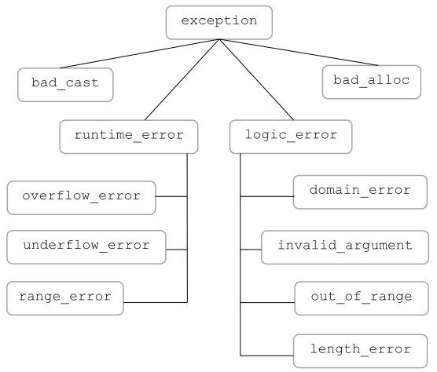

## Chapter 18 Tools for Large Programs

- [Section 18.1 Exception Handling](#exercise-181)
- Section 18.2 Namespaces
- Section 18.3 Multiple and Virtual Inheritance


### **Exercise 18.1**

> What is the type of the exception object in the following throws?
> (a)
>
> ```c++
> range_error r("error");
> throw r;
> ```
> (b)
> ```c++
> exception *p = &r;
> throw *p;
> ```
> What would happen if the `throw` in (b) were written as `throw p`?
>

**Answer:** (a) `std::range_error`.

It can be used to report range errors (that is, situations where a result of a computation cannot be represented by the destination type).

(b) `std::exception`.

All exceptions generated by the standard library inherit from it.

It would be an error, because `p` is a pointer that points to a local object `r`. By the time `p` is caught, the local object `r` may have already been destroyed.

### **Exercise 18.2**

> Explain what happens if an exception occurs at the indicated point:
>
> ```c++
> void exercise(int *b, int *e)
> {
>     vector<int> v(b, e);
>     int *p = new int[v.size()];
>     ifstream in("ints");
>     // exception occurs here
> }
> ```
>

**Answer:** Stack unwinding will take place. It will destroy the local objects in the reverse order of their creation.

- `in` is an `ifstream`. Its destructor will close the stream automatically, as a result of RAII (*Resource Acquisition Is Initialization*).
-  `p` points to a dynamically allocated array of `int`. Though there may be code after the exception to free the resource allocated from the heap, it will not be executed. Therefore, there will be a **memory leak**.
- `v` is a `vector`. Its destructor will be invoked, which will free the resource properly.

### **Exercise 18.3**

> There are two ways to make the previous code work correctly if an exception is thrown. Describe them and implement them.

**Answer:**

(1) Substitute another `vector`  for `p`

```c++
vector<int> q(v.size());
```

(2) Replace `p` with a smart pointer

```c++
shared_ptr<int> p(new int[v.size()]);
```

### Exercise 18.4

> Looking ahead to the inheritance hierarchy in Figure 18.1 (p. 783), explain what’s wrong with the following `try` block. Correct it.
>
> 
>
> ```c++
> try {
>     // use of the C++ standard library
> } catch (exception) {
>     // ...
> } catch (const runtime_error &re) {
>     // ...
> } catch (overflow_error eobj) { /* ... */ }
> ```
>

**Answer:** In a list of `catch` clauses, the most specialized `catch` must appear first. In other words, multiple `catch` clauses with types related by inheritance must be ordered from most derived type to least derived.

The above `try` block did exactly the opposite: starting from catching the most general `exception` and ending with catching the most specialized `overflow_error`. In this way, any exceptions of or derived from `exception` will be caught by the first `catch`, and the following catches will never be matched.

To correct it, reorder the `catch` clauses like

```c++
try {
    // use of the C++ standard library
} catch (overflow_error eobj) {
    // ...
} catch (const runtime_error &re) {
    // ...
} catch (exception) { /* ... */ }
```

### Exercise 18.5

> Modify the following `main` function to catch any of the exception types shown in Figure 18.1 (p. 783):
>
> 
>
> ```c++
> int main() {
>     // use of the C++ standard library
> }
> ```
>
> The handlers should print the error message associated with the exception before calling `abort` (defined in the header `cstdlib`) to terminate `main`.
>

**Answer:** Be careful of the order: *the more specific `catch` clauses appear before the more general ones*.

Besides, recall the idiom: *throw by value, and catch by const reference*.

```c++
int main()
{
    try {
        // use of the C++ standard library
    }
    catch (const bad_cast & e)          { cerr << e.what() << endl; abort(); }
    catch (const overflow_error & e)    { cerr << e.what() << endl; abort(); }
    catch (const underflow_error & e)   { cerr << e.what() << endl; abort(); }
    catch (const range_error & e)       { cerr << e.what() << endl; abort(); }
    catch (const runtime_error & e)     { cerr << e.what() << endl; abort(); }
    catch (const domain_error & e)      { cerr << e.what() << endl; abort(); }
    catch (const invalid_argument & e)  { cerr << e.what() << endl; abort(); }
    catch (const out_of_range & e)      { cerr << e.what() << endl; abort(); }
    catch (const length_error & e)      { cerr << e.what() << endl; abort(); }
    catch (const logic_error & e)       { cerr << e.what() << endl; abort(); }
    catch (const bad_alloc & e)         { cerr << e.what() << endl; abort(); }
    catch (const exception & e)         { cerr << e.what() << endl; abort(); }
    return 0;
}
```

*Note that neither `catch` nor `try` may omit the pair of parentheses following it, even the statement is a single line.*

- [code](code/18-05.cpp)
- an extra [demo](code/18-05-demo.cpp): throw and catch various standard exceptions in a repeated manner

### Exercise 18.6

> Given the following exception types and `catch` clauses, write a `throw` expression that creates an exception object that can be caught by each `catch` clause:
>
> (a) `class exceptionType { }; catch(exceptionType *pet) { }`
>
> (b) `catch(...) { }`
>
> (c) `typedef int EXCPTYPE; catch(EXCPTYPE) { }`
>

**Answer:** (a) `throw new exectionType;`

(b) `throw "whatever";`

(c) `throw 42;`

- [code](code/18-06.cpp) (*with a little variation to explore the language*)

### Exercise 18.7

> Define your `Blob` and `BlobPtr` classes from Chapter 16 to use function `try` blocks for their constructors.
>

**Answer:** Recall that `Blob` is a class that provides shared access to an object. It has three versions of constructors.

```c++
// default constructor
template<typename T>
Blob() : data(std::make_shared<std::vector<T>>()) {}
// constructor for an initializer list
template<typename T>
Blob(std::initializer_list<T> il) : data(std::make_shared<std::vector<T>>(il)) {}
// constructor that takes two iterators (Exercise 16.24)
template<typename T>
template<typename I>
Blob(I b, I e) : data(std::make_shared<std::vector<T>>(std::vector<T>(b, e))) {}
```

Now to use function `try` blocks for the constructors

```c++
// default constructor
template<typename T>
Blob<T>::Blob()
    try : data(std::make_shared<std::vector<T>>()) {}
    catch (const std::bad_alloc & e) {
        std::cerr << "Out of memory. Object not initialized properly." << std::endl;
    }
// constructor for an initializer list
template<typename T>
Blob<T>::Blob(std::initializer_list<T> il)
    try : data(std::make_shared<std::vector<T>>(il)) {}
    catch (const std::bad_alloc & e) {
        std::cerr << "Out of memory. Object not initialized properly." << std::endl;
    }
// constructor that takes two iterators (Exercise 16.24)
template<typename T>
template<typename I>
Blob<T>::Blob(I b, I e)
    try : data(std::make_shared<std::vector<T>>(std::vector<T>(b, e))) {}
    catch (const std::bad_alloc & e) {
        std::cerr << "Out of memory. Object not initialized properly." << std::endl;
    }
```

### Exercise  18.8

> Review the classes you’ve written and add appropriate exception specifications to their constructors and destructors. If you think one of your destructors might throw, change the code so that it cannot throw.
>

**Answer:**

### Exercise  18.9

> Define the bookstore exception classes described in this section and rewrite your `Sales_data` compound assignment operator to throw an exception.
>

**Answer:**

```c++
class out_of_stock : public std::runtime_error
{
public:
    explicit out_of_stock(const std::string & s) : std::runtime_error(s) {}
};

class isbn_mismatch : public std::logic_error
{
    const std::string left;
    const std::string right;
public:
    explicit isbn_mismatch(const std::string & s) : std::logic_error(s) {}
    isbn_mismatch(const std::string & s, const std::string & lhs, const std::string & rhs)
        : std::logic_error(s), left(lhs), right(rhs) {}
}

Sales_data & Sales_data::operator+=(const Sales_data & rhs)
{
    if (isbn() != rhs.isbn())
        throw isbn_mismatch("Wrong ISBNs.", isbn(), rhs.isbn());
    units_sold += rhs.units_sold;
    revenue += rhs.revenue;
    return *this;
}
```
*Q: Why isn't there an `explicit` specifier for the last `isbn_mismatch` constructor?*

*A: The `explicit` keyword is meaningful only on constructors that can be called with a single argument. Constructors that require more arguments are not used to perform an implicit conversion, so there is no need to designate such constructors as `explicit`.*


### Exercise 18.10

> Write a program that uses the `Sales_data` addition operator on objects that have differing ISBNs. Write two versions of the program: one that handles the exception and one that does not. Compare the behavior of the programs so that you become familiar with what happens when an uncaught exception occurs.
>

**Answer:**

### Exercise 18.11

> Why is it important that the `what` function doesn't throw?

**Answer:** It promises the caller of `what`, which is usually a handler trying to examine the content of the exception, that it will never deal with another exception may occur in the process of examination . Consider a common scenario

```c++
try {
     // some operation that may throw
}
catch (const exception & e) {
    // examine the exception
    cerr << e.what() << endl;
}
```

If the `what` function might throw,  the code might fall into an endless loop of try and catch:

```c++
try {
    // some operation that may throw
}
catch (const exception & e) {
    // examine the exception, knowing that this examination might throw again
    try {
        cerr << e.what() << endl;
    }
    // catch the exception thrown in the process of examination
    catch (const exception & e2) {
        // examine the exception, knowing that this examination might throw again
        try {
            cerr << e2.what() << endl;
        }
        // catch the exception thrown in the process of examination
        catch (const exception & e3) {
            // examine the exception, knowing that this examination might throw again ...
        }
    }
}
```

[Back to Top](#chapter-18-tools-for-large-programs)

